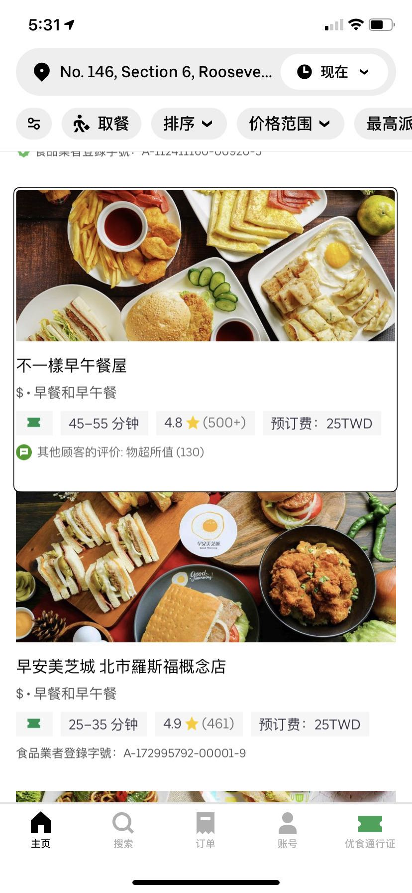

# 群内讨论收藏

* [未回答问题](#未回答问题)
* [无障碍设计与开发](#无障碍设计与开发)
	* [用研招募如何区分低视力用户与读屏用户？](#用研招募如何区分低视力用户与读屏用户)
	* [无障碍用户调研，co-design，可用性vs易用性](#无障碍用户调研co-design可用性vs易用性)
	* [无障碍做得好的中文app推荐，焦点合并问题](#无障碍做得好的中文app推荐焦点合并问题)
* [日常生活](#日常生活)
	* [视障人士坐电梯/扶梯时的需求和问题](#视障人士坐电梯扶梯时的需求和问题)
	* [室内导航技术](#室内导航技术)
	* [盲道的问题](#盲道的问题)
* [科技产品使用](#科技产品使用)
	* [字幕 - subtitle, closed captions, SDH的区别](#字幕---subtitle-closed-captions-sdh的区别)

  

---

## **未回答问题**

**@嗜热链球菌：**
> Hello想请问一下大家有没有碰到过remote usability testing的时候如果有人用apple magnifier进行zoom screen sharing，研究员看不到受试者magnifier里面放大的内容的情况啊

  

---

## **无障碍设计与开发**

### 用研招募如何区分低视力用户与读屏用户？

**@嗜热链球菌：**
> 我现在的项目是测试阿拉斯加航空desktop网页的accessibility问题，想要测试的人群是people with low vision。 我们本来预期招募到的受试者应该是用zoom/magnifier一类的工具或者是zoom/magnifier+Voiceover一类的工具。但是现在招募到的一些人是只使用screenreader的用户 [...] 就很好奇你们行业内测试的话是把用不同类型tool的人分开测还是说可以混在一起?

**@Jimmie：**
> 我所在的产品组找了Level Access来做的测试，他们确实有不同类型的用户，有的是用Zoom Text，有的是用Screen Reader，发现的问题也确实不一样。我们给了他们test cases，他们就是找了不同的用户，测试同样的cases。招人的话还是这些专业的公司比较有效。

**@夏冰莹：**
> 我们会分low vision user和screen reader user这两类，screen reader user指主要使用读屏软件操作的人，low vision user用的tool比较广，包括但不限zoom / large text / color inversion and correction / bold text / screenreader。招募screening的时候我们会问你使用哪些assistive technology，而不是你是否self-identify as [a certain disability]，这也是包容性调研方法的一种best practice。

**@嗜热链球菌：**
> 那如果是两种都用的人应该放在哪一个group里面测试呢。。？比如又用zoom又用jaws这种screenreader的

**@夏冰莹：**
> 用screen reader的人我们会follow-up问你有多少时间是使用screen reader的，超过50%我们归类为screen reader user。但是也不是很严格啦，主要还是为了保证user pool 比较多元，各种都有一点。

**@丁尧：**
> 冰莹和张涛老师说的很完整了，总结一下是low vision可能用一种或几种组合：
> 
> 1）magnification
> 
> 2）text to speech，比如ZoomText（注意这个不是screen reading）
> 
> 3）high contrast
> 
> 4）screen reader
> 
> 这些尽量在screener里都问清楚👌

  

---

### 无障碍用户调研，co-design，可用性vs易用性

**@夏冰莹：**
> 我也提醒产品同学们不要直接在这个群里做直接的用户调研，这个群里的障碍用户都是顶层用户，有参考价值但不具备代表性，你们也得出去采访更多类型的用户

**@欣杰：**
> 冰莹老师说的太对啦。下一个阶段应该考虑从被动式用户调研（倾听痛点和需求点）过渡到co-design。能看到越来越多的残障朋友们成为同事和合作伙伴，才是设计的包容体现。我们是一同设计，而不只是为对方设计[加油]

**@Olivia：**
> 很同意！聆听痛点那些是最开始的user interview要做的，真正iteration需要的是participatory design

**@夏冰莹：**
> participatory design +1，我觉得【团队里有残障同事】和【进行大量多元用户的迭代调研】都要进行，而且残障调研特.别.容.易陷入"找到的用户全都是过于了解科技的顶层用户”，所以也要留意，不是一两个盲人用户说"我需要以下100个能帮到我的高级设定"你就真的要加100个高级设定进去，而是更深入地了解为什么会有这些需求

**@Meng：**
> 赞同+1，我们组之前就为霍金做轮椅上的电脑，组里也有高位截瘫的同事全程involve，虽然我们不是专门做accessibility的，但是因为有那个同事，很多时候brainstorming可以有很多很好的我们想不到的点。

**@张阳：**
> 感觉群里的视障朋友们，其实很理性的反复在告诉我们产品经理，**、别乱搞，先把标签加好，把焦点搞定**。这个其实适用所有的产品设计，别乱搞。 
> 
> 嗯呐，加好标签，做好焦点这个最基础的事情的最大难点其实是要能长期坚持做好。不然心血来潮，修了一堆bug，一迭代又坏了。长期做好这个事情，可能比做几个漂亮的功能更有意义，也更有挑战。 
> 
> 而且最后修改这种很难有人愿意做，没有visibility，又很辛苦。

**@夏冰莹：**
> 需要把无障碍适配融入到平时的开发流程当中、记录下来，不然one-off的无障碍改造肯定是无法坚持的。 
> 
> 对，这个就需要领导表态了，比如考核的时候无障碍改进可以作为加分项，或者我们大组是有product inclusion award这种奖励机制的。

**@王慧：**

> 冰莹老师好，对这个说法有一点不同思考。不知道为什么，昨天晚上我们讨论的时候，我其实就感觉到您看了发言一定会来做这个提醒，哈哈。可能是看您文章比较多，对您的观点比较了解吧。
> 
> 我觉得，首先目前的无障碍，我们讨论的其实还是可用而不是易用，可用是一个产品所应有的属性，并不是需求。重点解决的是基础的共性问题。如果到了易用性的层面，才有必要考虑用户的代表性等等。
> 
> 其次说说代表性的问题，我个人觉得我们昨天所说的，都是一些普遍的可用性问题，例如反复强调的标签、焦点等，并没有说太多个性化的东西。我有时候比较担心一些简单的所谓调研，因为要对一个产品提出合理的建议找出问题，首先是对这个产品要有了解，而产品可用性解决之前，包括我们在内的许多伙伴其实对产品都是缺乏了解的。如果对产品本身不够了解，针对可用性所提出的建议其实是存疑的。见过一些产品最终在可用性还没有达到的时候就跌入了不停的搜集用户需求的怪圈。
> 
> 我们还从来没能顺利用上这个功能，总来问我们怎么做你们觉得更好，有点不知所措。这就跟我从来都没吃过螃蟹，你非要问我怎么做好吃一样有意思。而如果是不加思考的回答，对螃蟹怎么做好吃可能会得到许多答案，但经过思考的，都会提醒你我能不能 先尝一下螃蟹。
> 
> 最后要能分的清什么是必须改进的共性问题，什么是需要建立在可用性实现后，针对不同需求所做的个性化设计，这个是需要一定的知识和经验的积累。

**Sam：**
> 我们一直有个观点：做好产品的无障碍，根本就不是什么需求，也谈不到提需求，你的产品无障碍不好，就是纯粹的产品有bug。如同有用户反馈说，你的产品只要点击某个按钮就会导致程序闪退，那产品需要做的是修复bug，而不是问用户，那你觉得点击后应该达到什么效果？所以，都2021年了，还有很多产品经理认为做无障碍是用户需求，这实在是不妥。

**王慧：**
> 您讲的很好，我们其实也非常愿意参与到具体的设计开发之中。融合一定是解决无障碍问题和残障认知的最好方式。甚至不仅是工作上的协作融合，教育上的全纳教育等等，都是可以推进的方向。
> 
> 但目前的现实是，我们大家想找一个视障人与明眼人可以一起顺利使用的在线办公软件都如此困难，障碍都如此多，如果没有超强的能力和心理素质，是没有办法开展工作的。即便有这些，也只是具备了努力让自己融入团队的可能性，后续是否能真正获得可以正常工作的无障碍支持和帮助，也是未知数。
> 
> 其实目前多数软件的问题还是停留在可用性的层面，甚至如果有一个走心的产品经理，不需要做调研都应该知道怎么改。当然我不是批评热心的产品经理们，大家目前的一个普遍情况是对残障的基本认知缺失。从来都不知道视障人能用智能手机和电脑，突然有人告诉你我因为视障用不了你的软件，我想产品经理一定是晕乎的。所以目前的这种现状我完全理解大家。
> 
> 一点点来吧，我的观点就是勿以善小而不为，如果您在公司内部能推动建立整个无障碍的体系当然好，如果不能，也请力所能及的将您所涉及到的部分尽量做到可用，哪怕是将标签写标准，将焦点做规范，其实都是对无障碍的推动，都能让障碍人群在使用的时候少一点惆怅。[抱拳][抱拳][抱拳]

**杨永全：**
> 这个我觉得说的很有道理。  一定要广泛的调研，我们见过太多这样的无障碍例子，要么只听顶层用户的，要么只听底层用户的结果，做出一些特别极端的东西

**王慧：**
> 我个人认为一个产品的可用性，并不需要太广泛的调研。当满足可用性之后，需要做广泛全面的调研来实现易用性。不然很可能在可用性阶段就陷入无休止的调研怪圈。

**夏冰莹：**
> 说得对，达到最基本的可用是压根不需要去做什么用户调研的，安卓 iOS Mozilla/W3C等开发者文档里面已经把规范解释得很详细了，也有自动化的测试工具，学一下照着做就是了，比做用户调研要快多了。

  

---

### 无障碍做得好的中文app推荐，焦点合并问题

HOHO：
> 请教，国内在无障碍提示方面有做的比较出色的不？可能微信还不错？

三盛：
> **IT之家**，感觉无障碍就比较好。

夏冰莹：
> 我记得**下厨房**的无障碍好像做得意外的不错...
> 下厨房不是所有按钮都有标签，但是有的标签写得都不错，简短清晰

王慧：
> 您可能想不到，就连微信也还有许多按钮连标签都没有，更别提提示的正确与否了。
> 实际上冰莹老师刚才说的两个原则就很好了，重要内容前置加简短清晰

Eureka：
> 还有个小APP **古诗文网**，在屏幕阅读器下体验还不错，当然不是说他本身具备朗读功能，而是许多标签和焦点处理很好

小伙身上有wifi：
> **腾讯课堂**无障碍不错，这是我见到播放页面能操作比较好的
> 真的要表扬腾讯课堂播放页面的无障碍，有个问题就是操作按钮消失太快了。不知道这是不是有优化过。

火影：
> 安卓端的微信，无障碍很糟糕。

杨永全：
> 有一个应用是**微喇**，也可以看一下。它的很多地方提示还是可以的
> 不过也有一些提示冗余的地方可以看看 

Eureka：
> 应该批评支付宝的是有些页面直接提示 不支持屏幕阅读器

火影：
> 跟这个相似的**Ios端唱吧**处理的还是比较不错的，安卓的目前我真的没有想起哪个是比较类似好的。

夏冰莹：
> 哦对**uber eats**的台湾中文版做得不错 
>   
> 比如说uber eats首页每个餐馆是一个大的焦点，不用滑很多次，这个焦点的朗读内容是：不一样早餐屋，价格低于平均值，类别 早餐和早午餐，将在45-55分钟后送达，评分4.8星、基于500多个评价，送餐费25新台币
> 能感觉到有认真考虑把视觉信息合理转换为容易理解的文字

SUN：
> 信息结构化了👍🏻

HOHO：
> 但这样处理，会不会导致效率降低，比如我想快速了解送餐时间，只能等他说完？@夏冰莹 - 谷歌无障碍设计 

夏冰莹：
> 这是个好问题，不同用户的需求也会不一样，我觉得没有one size fits all的答案
> 不过我们确实经常听到用户抱怨读屏软件操作会导致手很累。所以重要信息前置很重要…
> uber eats这个低信息量，合并焦点还可以，毕竟读屏速度都开得很快，但如果是很大一段话比如微信朋友圈的内容，就不适合合并了

杨永全：
> 其实焦点合并也是有一些争议的。我觉得也是存在有些信息放到后面可能会影响获取效率。对于低视力用户来讲，交警合并可能也不是一个好事情
> 我感觉苹果系统下的焦点合并是有些过度的

火影：
> 具体页面具体说有一些页面真的不能合并大的焦点。
> 就像MIUI有一次把天气的整个预告全部是一个大的焦点，结果小伙伴们纷纷抗议。

Eureka：
> 对，这个是很典型的15日的天气合并成为一个焦点

火影：
> 然后还有一段时间就是MIUI锁屏页面焦点过于多了，这个时候也纷纷抗议，所以我觉得这个不能一味的怎样怎样，有的时候的确具体页面需要不同的处理。

王慧：
> 不过这个其实也属于易用的范畴了。具体到抖音，其实目前阶段还不用考虑这种问题。因为抖音是压根没有焦点，所以暂时可以不考虑是否合并的问题，因为读都读不到。特别典型的是订单提交界面。

杨永全：
> 搜狗。拼音的PC版无障碍做的还是很扎实的

  

---

## **日常生活**

### 视障人士坐电梯/扶梯时的需求和问题

**杨永全：**
> 电梯里对于视障人，需要盲文或者语音提示。

**清风扬：**
> 1-开启语音功能。一般电梯都有。2-按钮粘贴盲文标签。语音是很多维护物业不知道这个功能，应该都能开启。而且实用性很高。不只是方便盲人。

**懒人：**
> 相对于电梯，扶梯才难弄，缺乏播报，且都在人流量大的地方

**风清扬：**
> 扶梯吧，我没难度。唯一的难度就是不知道这是向上还是向下的。

**卢镇洲：**
> 确实，特别是没人的时候会为了省电降速度，很慢很慢。

**Sam：**
> 摸扶手判断扶梯上下我确实没经验，我常用的方法使用盲杖探路，以此感知扶梯市上试下。

**王慧：**
> 这个不至于吧。因为向上的扶梯在出口的位置，方向和向下的扶梯是完全不一样的。只要用手摸到扶手的位置上，就能判断出来。简单说就是一定要分清扶梯是入口还是出口。如果是入口的话，不管上下，方向都是向前的。如果你站在出口，那么方向就是反的。经常独立出行坐扶梯的就会发现，最重要的是要知道自己是站在扶梯的入口还是出口。而不是先分清上下

**Bubble：**
> 扶手判断不了上下，只能判断是离开还是进入这个楼层的

**小龙蛋：**
> 坐扶梯呢其实有几种方法可以结合使用。第一，你仔细听，你能听出扶梯是向上还是向下的声音。第二，你靠近电梯了，那个轰隆的声音你就能感受到。有电梯伸出你可爱的双手，试着向前触摸一下，应该能摸到扶手。第三，实在不行，拿着你可爱的盲杖向前试探一下，你就知道电梯向上还是向下了。第四，在电梯的附近等一等，听一下人上或者是下的声音，如果是下，应该有人向你走过来，如果是上，应该有人和你同方向走上去。

**王慧：**
> 简单总结下视障人乘坐扶梯的方法吧，第一步先分清自己是站在扶梯的入口还是出口。大家想一下，任何扶梯，不管上下，都是有入和出的。而你如果站在出口上，是肯定不行的。这个很容易区分，手只要摸到扶梯的扶手上，感觉下运动的方向就可以了。然后就是判断向上还是向下，这个也不难，手顺着扶梯运动的方向向前一点，到扶手开始有向下或者向上角度的位置，就能知道是上还是下了。

**王慧：**
> 其实视障人出门，如果说电梯，最困难的真不是扶梯，最困难的是去陌生地方且没有人的没有语音的直梯，那真是不知道到几层了。

  

---

### 室内导航技术

**Sam：**
> 我现在最最期待的技术是室内导航。现在盲人无论去地铁站，高铁站还是机场，无人陪伴是绝对走不到廊桥的。如果有拉好米级别的室内导航技术，并且普及到绝大部分的公共场所，我们就可以完全无人陪护去坐飞机，坐高铁了。说实话，我们是最不愿与麻烦人工服务员的一群人，如果自己能解决的问题绝对不愿意麻烦，哪怕是任何一个人。

**风清扬：**
> 室内我也期待，我主要是想自由去商超溜溜弯。我不想知道我要买啥，我想知道在商超我能买啥。

**王慧：**
> 室内导航+1

**Sam：**
> 其实室内导航从技术上，现在已经没有问题了，但就是标准不统一，普及太漫长。

**云：**
> 室内导航+1

**Sam：**
> 各位可以预测一下。基于蓝牙技术或超宽带定位的室内导航，还有多少年才能广泛普及啊！我怕我等不到那一天就先被忙到解决掉了。！那就真有点人间不值得了。

  

---

### 盲道的问题

**小伙身上有wifi：**
> 我发现长沙地铁站的盲道不会去扶梯的方向，一般都是走楼梯。虽然扶梯就在楼梯的旁边。

**Sam：**
> 就别再讨论中国的忙到了，越说越生气！他们建设忙到的时候根本就没有用户调研，都是屁股决定脑袋。我敢说偌大的中国总共也找不出来10条合格的忙到！ 
> 
> 再次给中国的忙到下个定义：中国忙到是用来解决掉盲人的！我相信走过忙道的人们都会同意我的定义。解决不掉问题，就解决掉出问题的人。这就是思路。

**风清扬：**
> 要想死的妙，天天走盲道。

**Sam：**
> 我上下班天天都要走各种类型的忙到，虽然现在还活着，但我时刻准备着！不跟你们开玩笑，我是认真的。

**风清扬：**
> 我有时候，都感叹，盲人的命，不对中国盲人的命该有多硬，才能从幼年到成年，从成年到老年。

**小伙身上有wifi：**
> 之前因为共享电动车占用盲道，然后有人就经常去市长热线投诉，后来是城管组织共享车单位开了个会。问题算基本改善

**Sam：**
> 哈哈，一段时间之后肯定恢复原貌！另外盲道上停放共享单车只是众多问题中的一种，不算啥严重问题。断头，电线杆，陷阱，你能想到的和你想不到的捕猎方式盲道上都有。

**风清扬：**
> 所以苹果发布watch 摔倒检测功能我身为中国老盲，哭的稀里哗啦的。这不就是中国盲道配套产品。黄金搭档。不知道您将去哪儿，有apple 地图。如果你摔倒了，嗯，没关系。让我们通知急救中心。

**小龙蛋：**
> 在某些短视频的软件上面反馈这些无障碍不好的问题，有时候还会被平台给你一个。官方反馈说有碍社会和谐，不给予流量推荐。

  

---

## **科技产品使用**

### 字幕 - subtitle, closed captions, SDH的区别

**王玄：**

> captions 和 subtitles 都是字幕，意思是一样的 \
> Closed Captions 就是软字幕，字幕与视频是分离的 \
> 与此对应的是 Open Captions，就是硬字幕，字幕已经压到视频画面里了 \
> 包括环境音效的字幕叫 subtitles for the deaf or hard of hearing，简称 SDH \
> 如果字幕被称为 SDH，是一定会有音乐、引擎声等环境音描述的。 \
> 如果字幕仅被称为 captions 或 subtitles，那么可能就没有包含环境音描述 \
> CC 是 Closed Captions，不必然是 SDH 字幕。
> 
> 只见到 CC 按钮没有见到过 OC 按钮是因为只有 CC 可以开关的。Open Captions 不能开关，自然就没有这个按钮或者选项。
> 
> 当然啦，以上是对于一些英语名词的解释 \
> 中文语境中也许没有必要沿袭英文名词，可以自造我们自己的中文术语？
